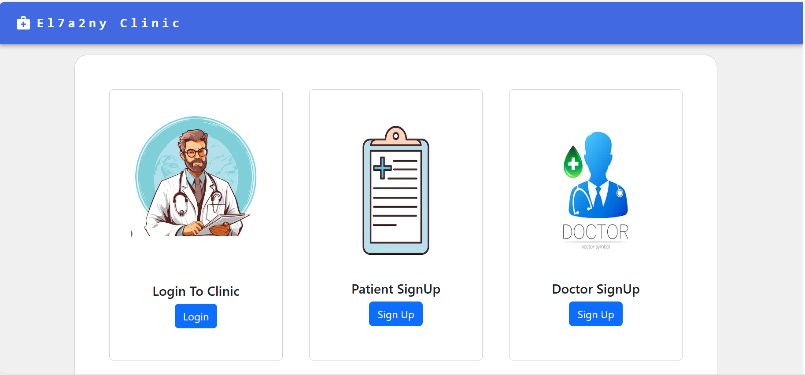
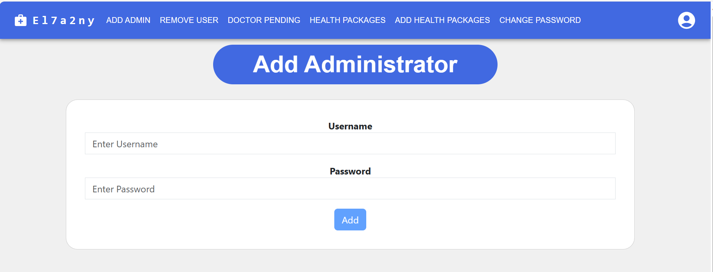
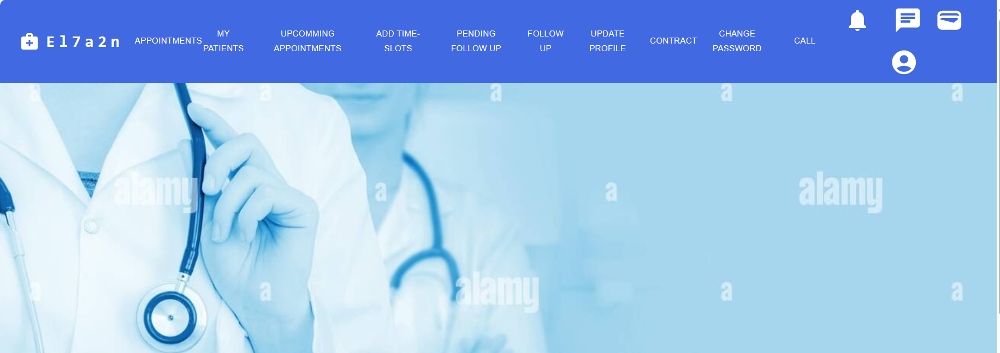
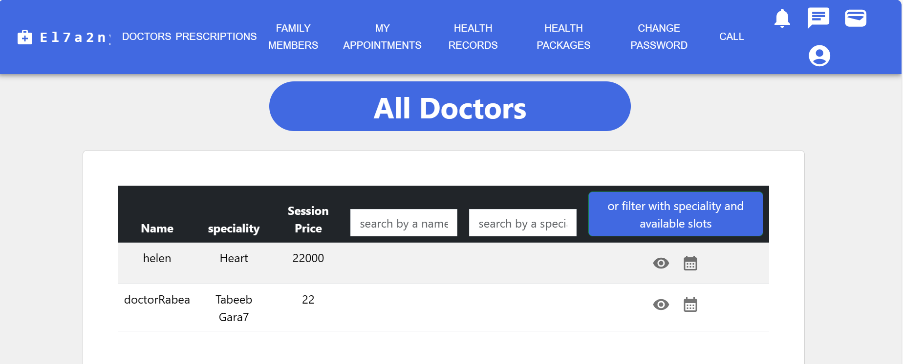
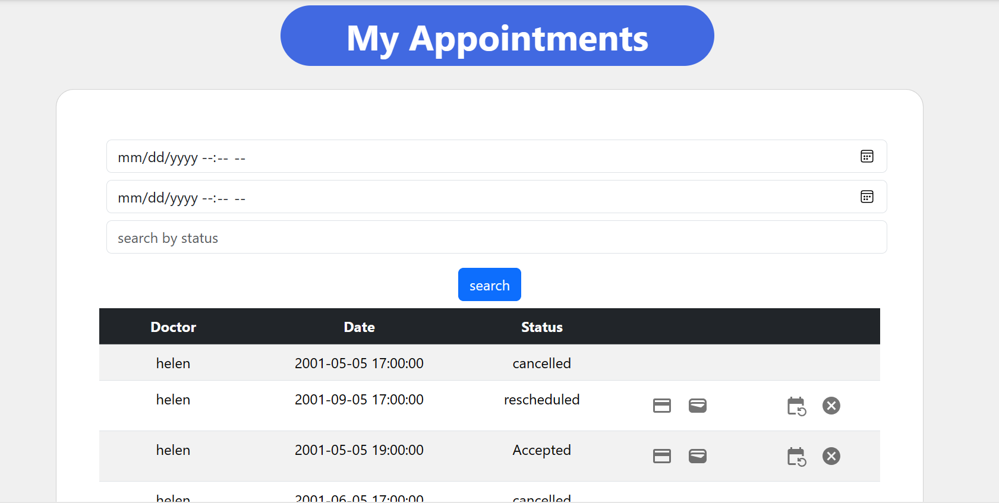
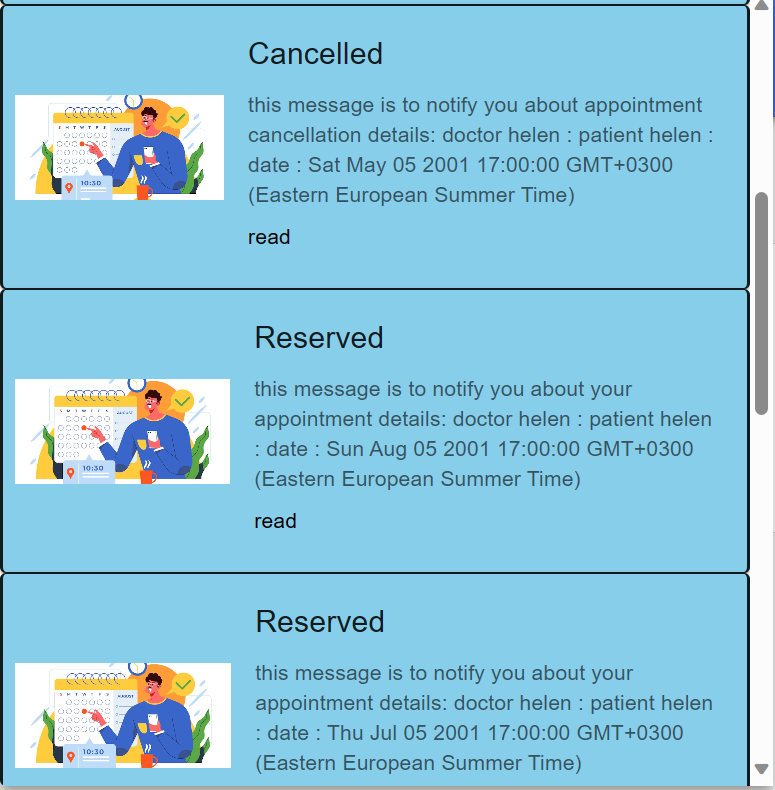

# El7a2ny - Virtual Clinic Management System
Welcome to El7a2ny, your one-stop Virtual Clinic Management System. Built with the MERN stack, El7a2ny is designed to revolutionize healthcare interactions for clinics, doctors, and patients.

## Motivation
✨El7a2ny is here to make healthcare easy for everyone. ✨
 our project aims to simplify healthcare processes, providing an efficient and accessible platform for users to find doctors, schedule appointments, manage medical records ,and get medical prescriptions online.
 With El7a2ny, we're bringing a new level of ease and convenience to healthcare interactions. 😉


## Badges 


## Table of Contents

- [Build Status](#Build-Status-🔨)            
- [code style](#code-style-📜)                         
- [screenshots](#screenshots-🖵)                        
- [Tech/Framework Stack](#Tech/Framework-used)    
- [Features](#Features)                           
- [Code Examples](#Code-Examples)                 
- [configuration](#configuration)                 
- [Installation](#installation)                   
- [API reference](#API-reference)                     
- [Tests](#Tests)                                 
- [How to Use?](#How-to-Use?)
- [Contributing](#contribute)
- [Credits](#credits)
- [License](#license)


## Build Status 🔨

[](https://github.com/advanced-computer-lab-2023/Apollo-8-Clinic/actions/workflows/NodePackage.yml)

- The project is currently in development.
- The admin panel requires modifications for managing health packages while the patient is subscribed.
- The testing technique needs improvement. Plan to create Jest test files and enable them as workflows for more robust and efficient testing.
- Future improvements:
  - Implement a caching layer to improve application performance.
  - Integrate a message broker to handle asynchronous tasks such as sending emails and notifications.

## Code Style 📜

This project adheres to the following code style guidelines:

1. **Naming Conventions**: 
- For Variables and function names, Use camelCase.

2. **Comments**:
- Add comments before functions and complex logic to explain their purpose.
- Keep comments concise and informative.

3. **File Organization**
- The project is organized into the following main directories:
  - `server`: Backend server code.
  - `client`: Frontend React application.

4. **Version Control**
- Use Git for version control.
- Write clear and concise commit messages following [Conventional Commits](https://www.conventionalcommits.org/) guidelines.

5. **Whitespace**:
- Use whitespace to make the code more readable. There should be whitespace around operators and after commas.

6. **Coding Standards**
- Follow the [Airbnb JavaScript Style Guide](https://github.com/airbnb/javascript) for our JavaScript/React code.

Please ensure your code adheres to these guidelines before submitting a pull request.

## screenshots 🖵

### Main Registeration page

First landing page for users; dual signup for doctors and patients, with sign-in option for doctors, patients, and admins.




### Admin HomePage

The admin homepage provides a centralized dashboard for convenient access to key features. Easily manage administrators, handle doctor requests, and oversee health packages. Ensure secure account control by updating your password directly from the dashboard.





### Doctor HomePage

Doctors can navigate through a specialized toolbar with options such as managing appointments, viewing patients, scheduling follow-ups, updating their profiles, and more. 




### Patient HomePage

Centralized access to patient options via a top bar including Doctors Prescriptions, Family Members, My Appointments, Health Records, Health Packages, Change Password, View Wallet, and Logout.


### View all doctors

Explore a comprehensive table featuring doctors, with options to filter by specialty and available slots. Use the search function to quickly find specific doctors.




### Appointment History

Display the patient's appointment history, with options to filter by appointment date or status. 




### Notification System for doctor

Optimize scheduling efficiency with our specialized notification system tailored for doctors.




## Tech/Framework used 🧰

El7a2ny is built using the MERN (MongoDB, Express.js, React, Node.js) stack.

- Tool:
    - VS code
    
- Frontend:
    - React
    - Bootstrap
    - Material-UI

- Backend:
    - Node.js  v18.18.0.
    - Express.js
    - MongoDB
    
## Features ✨

### Doctors

- **Authentication and Profile Management:**
  - Login/logout.
  - Change password.
  - Update email, hourly rate, or affiliation (hospital).

- **Health Records and Appointments:**
  - View patient information and health records.
  - Add new health records for patients.
  - Start/end video calls with patients.
  - Manage prescriptions (add/delete medicine, update dosage).
  - Schedule follow-up appointments.
  - View a list of all patients.
  - Search for a patient by name.
  - Reschedule appointments for patients.
  - Accept/revoke follow-up session requests from patients.
  - View wallet balance.
  - Chat with patients.

### Patients

- **Authentication and Profile Management:**
  - Register as a patient.
  - Login/logout.
  - Change password.
  - Add family members.
  - Link family members' accounts.
  - View registered family members.

- **Health Records and Appointments:**
  - Upload/remove medical history documents.
  - View health records.
  - View prescriptions.
  - Choose payment method for appointments and prescriptions.
  - View upcoming/past appointments.
  - Reschedule/cancel appointments.
  - Receive appointment notifications.
  - Search for doctors by name and/or specialty.
  - View doctor details.
  - View available appointments.
  - Select appointment date and time.

- **Wallet and Payments:**
  - Receive a refund in the wallet.
  - View wallet balance.

- **Messaging:**
  - Chat with doctors.

### Admins

- **User Management:**
  - Add another administrator.
  - Remove a doctor/patient/administrator.

- **Doctor Registration and Approval:**
  - View information uploaded by a doctor.
  - Accept or reject a doctor's request to join.
  - Accept a request for doctor registration.

- **Health Packages:**
  - Add/update/delete health packages.
  - View status of health package subscriptions.
  - Cancel health package subscriptions.

- **System Notifications:**
  - Receive notifications of various system activities.

- **Search and Discovery:**
  - View a list of all doctors.
  - Search for a doctor by name and/or specialty.
  - Filter doctors by specialty and/or availability.
  - View doctor details.
  - View all available appointments of a selected doctor.

and much more to discover... 😊🚀

## Code Examples 🐱‍💻
here are some code examples for developers to have an overview about our implementation

#### register for a new user:
```javascript
// Create a new user instance and save it in the database

 const user = new UserModel({ username, password, type });
 await user.save();
```
#### login:
```javascript
// Extract user information from the request body
const { name, password } = req.body;

// Find the user in the database
const user = await UserModel.findOne({ username: name });

// Compare the provided password with the user's stored password
const passwordMatch = await bcrypt.compare(password, user.password);

// Create a token for the user and send it to the browser
const token = createToken(user.username);
res.cookie('jwt', token, { httpOnly: true, maxAge: maxAge * 1000 });
return res.status(201).json({ token: token });

```

#### book an appointment:
```javascript
 // Create a new appointment
const appointment = new AppointmentModel({ doctorId, patientId, date, status, type });

// Update and save the doctor's schedule by removing the booked slot
const updatedDoctor = await DoctorModel.findOneAndUpdate(
  { "_id": doctorId },
  { $pull: { availableSlots: date } },
  { new: true }
);

// Save the appointment
await appointment.save();


```
#### view health records:
```javascript
// Retrieve patient information from the database using user ID
const patientId = req.params.patientId;
const patient = await PatientModel.findOne({ user: res.locals.userId });

// Send back the health records associated with the patient
const patientRecords = patient.health_records;
res.status(200).json(patientRecords);

```

## Configuration

### 1. Database Connection

Before running the project, make sure to set up your database connection by adding your MongoDB connection string to the `.env` file located in the `server` directory. Here's an example:

```env
DB_CONNECTION=mongodb+srv://<username>:<password>@your_cluster_url/your_database_name
```
### 2. Admin Setup

To ensure smooth operation of the system, it's necessary to manually add at least one admin user to your database. This can be done using MongoDB Compass.

## Installation 📥

Follow these steps to set up the project on your local machine:

1. **Clone the Repository:**
   ```bash
   git clone https://github.com/advanced-computer-lab-2023/Apollo-8-Clinic.git
   ```
   
2. **Open the Project in Visual Studio Code**

3. **choose view terminal and Setup the Server:**
```
cd sever
npm install
npm install mongoose node
```
4. **Start the Server:**
```
node index.js
```
5. **Open Another Terminal for the Client:**
```
cd client
npm install
npm install react react-dom
npm install react-bootstrap
npm install @mui/material @emotion/react @emotion/styled
```
6. **Start the Client Application:**
```
cd src
npm run dev
```
7. **Open any web browser and navigate to**
```
http://localhost:5173/
```

## API reference

<details> <summary>Patient APIs</summary>
 
#### GET /patient/
* *Purpose:* Retrieve all patients 
* *Authentication:* Required 
* *HTTP Method:* GET
* *Parameters:* none
* *Response:* List of patients or error message

#### Post /patient/
* *Purpose:* sing in new patient
* *Authentication:*not required
* *HTTP Method:* Post
* *Parameters:* none
* *Response:* new patient object or error message

#### GET /patient/getNotfication
* *Purpose:* get notification of certain patient
* *Authentication:* Required (Patient)
* *HTTP Method:* GET
* *Parameters:* none
* *Response:* list of patient notfication

#### GET /patient/sawNotfication
* *Purpose:* make notification status to read
* *Authentication:* Required (Patient)
* *HTTP Method:* GET
* *Parameters:* none
* *Response:* error or new notifications with updated status

#### GET /patient/byId
* *Purpose:* get data of certain patient
* *Authentication:* Required (Patient or doctor)
* *HTTP Method:* GET
* *Parameters:* none
* *Response:*get patient details or error

#### GET /patient/getPatientHealthPackage/:id
* *Purpose:* get health package of logged in patient
* *Authentication:* Required (Patient)
* *HTTP Method:* GET
* *Parameters:* none
* *Response:* healthpackage of certain patient or error

#### GET /patient/getPerscriptions
* *Purpose:* Retrieve perscriptions of logged user
* *Authentication:* Required (Patient)
* *HTTP Method:* GET
* *Parameters:* none
* *Response:*list of prescriptions or error message
#### POST /patient/filterPerscriptions
* *Purpose:* Retrieve prescriptions filtered by state or date or doctor name
* *Authentication:* Required (Patient)
* *HTTP Method:* POST
* *Parameters:* none (path parameter) date,state,name (body)
* *Response:* list of prescription or error

#### GET /patient/getPerscription/:id
* *Purpose:* Retrieve prescription details 
* *Authentication:* Required (Patient)
* *HTTP Method:* GET
* *Parameters:* prescription id (path parameter)
* *Response:* one prescription details
 
#### GET /patient/prescriptionPDF/:id
* *Purpose:* make pdf prescription 
* *Authentication:* Required (Patient)
* *HTTP Method:* GET
* *Parameters prescription id (path parameter)
* *Response:* generated pdf or error message

#### POST /patient/payForPrescription/:id
* *Purpose:* make prescription state filled
* *Authentication:* Required (Patient)
* *HTTP Method:* POST
* *Parameters:* prescription id (path parameter)
* *Response:* error or ensuring text

#### GET /patient/patientLogin
* *Purpose:* login patient
* *Authentication:* none
* *HTTP Method:* post
* *Parameters:* none  (path parameter) name password(request body )
* *Response:* error or the token

#### GET /patient/healthPackage
* *Purpose:*get all health packages.
* *Authentication:* Required (Patient)
* *HTTP Method:* GET
* *Parameters:* none (path parameter)
* *Response:* List of health packages or error message

#### GET /patient/healthPackage /:id
* *Purpose:* Retrieve certain health package details 
* *HTTP Method:* GET
* *Authentication:* Required (Patient)
* *Parameters:* healthPackage id (path parameter)
* *Response:* health package details or error message

#### POST /patient/subscribeForMe/
* *Purpose:* subscribe for certain health package
 * *Authentication:* Required (Patient)
* *HTTP Method:* POST
* *Parameters:* none (path parameter) health package name (reuest body)
* *Response:* insurance message  or error message

#### POST /patient/subscribeForFam/:id
* *Purpose:* subscribe for family member
* *Authentication:* Required (Patient)
* *HTTP Method:* POST
* *Parameters:* family member ID (path parameter) health package name (reuest body)
* *Response:* insurance message  or error message

#### POST /patient/cancelMYsubscription/
* *Purpose:* cancel my health package subscription
* *Authentication:* Required (Patient)
* *HTTP Method:* POST
* *Parameters:* none (path parameter) none(reuest body)
* *Response:* insurance message  or error message

#### POST /patient/cancelFMsubscription/:id
* *Purpose:* cancel subscribe for family member
* *Authentication:* Required (Patient)
* *HTTP Method:* POST
* *Parameters:* family member ID (path parameter) none (reuest body)
* *Response:* insurance message  or error message

#### POST /patient/unsubscribeForMe/
* *Purpose:*unsubscribe of my health package subscription
* *Authentication:* Required (Patient)
* *HTTP Method:* POST
* *Parameters:* none (path parameter) none(reuest body)
* *Response:* insurance message  or error message

#### POST /patient/unsubscribeForMember/:id
* *Purpose:* unsubscribe for family member healyh package
* *Authentication:* Required (Patient)
* *HTTP Method:* POST
* *Parameters:* family member ID (path parameter) none (reuest body)
* *Response:* insurance message  or error message

#### GET /patient/patientdetails/
* *Purpose:* Retrieve patient logged in data
* *Authentication:* Required (patient)
* *HTTP Method:* GET
* *Parameters:* none
* *Response:* patient Model or error message

#### GET /patient/getWallet/
* *Purpose:* Retrieve wallet of patient logged in
* *Authentication:* Required (patient)
* *HTTP Method:* GET
* *Parameters:* none
* *Response:* number for user balance or error message

#### GET /patient/NotlinkedFamily/
* *Purpose:* retrieve all Family Members NOT LINKED
* *Authentication:* Required (patient)
* *HTTP Method:* GET
* *Parameters:* none
* *Response:* List of family model  or error message


#### GET /patient/LinkedFamily/
* *Purpose:* retrieve all Family Members LINKED
* *Authentication:* Required (patient)
* *HTTP Method:* GET
* *Parameters:* none
* *Response:* List of family model or error message

#### POST /patient/AddFamilyMember
* *Purpose:* add new family member 
* *Authentication:* Required  (patient)
* *HTTP Method:* POST
* *Parameters:* none(parameter) name, nationalID, age, gender, relation(body)
* *Response:* Successfully message or error message

#### POST /patient/linkPatient
* *Purpose:* link patient to another
* *Authentication:* Required (patient)
* *HTTP Method:* POST
* *Parameters:* none (parameter)mail or number(body)
* *Response:* Successfully message or error message

#### POST /patient/getsessDiscount
* *Purpose:* get discount of health package you subscribed
* *Authentication:* Required (patient)
* *HTTP Method:* POST
* *Parameters:* none
* *Response:* discount number or error message

#### PUT /patient/updateWallet
* *Purpose:* update wallet amount in satabase
* *Authentication:* Required (patient)
* *HTTP Method:* PUT
* *Parameters:* none (parameter) amount add(body)
* *Response:* updated wallet amount or error message

#### GET /patient/health-records
* *Purpose:* Retrieve health record of patient
* *Authentication:* Required (patient)
* *HTTP Method:* GET
* *Parameters:* none (parameter) 
* *Response:* list of health record or error message

#### PUT /patient/health-records
* *Purpose:* add health record 
* *Authentication:* Required (patient)
* *HTTP Method:* PUT
* *Parameters:* none (parameters) date description (body)
* *Response:* Patient after saving health records or error message

#### PUT /patient/remove-health-record
* *Purpose:* remove a health record
* *Authentication:* Required (patient)
* *HTTP Method:* PUT
* *Parameters:* none (parameter) package_id(body)
* *Response*Patient after saving health records or error message

#### POST /patient/appointmentWithFilter
* *Purpose:* Retrieve all patients 
* *Authentication:* Required 
* *HTTP Method:* POST
* *Parameters:* none (parameters) startDate, endDate, status(body)
* *Response:* List of appointments or error message

#### GET /patient/mydiscount
* *Purpose:* Retrieve discount linked to certain page
* *Authentication:* Required (patient)
* *HTTP Method:* GET
* *Parameters:* none
* *Response:* discount quantity or error message

#### GET /patient/allDoctors
* *Purpose:* Retrieve all doctor
* *Authentication:* Required (patient)
* *HTTP Method:* GET 
* *Parameters:* none
* *Response:* List of doctors or error message

#### GET /patient/docInfo/:id
* *Purpose:* Retrieve certain doctors details
* *Authentication:* Required (patient)
* *HTTP Method:* GET
* *Parameters:* doctor_id(parameter)
* *Response:* doctor model or error message


#### GET /patient/docSearch
* *Purpose:* Retrieve all doctors with name or speciality search
* *Authentication:* Required (patient)
* *HTTP Method:* GET
* *Parameters:* none
* *Response:* List of doctors or error message

#### GET /patient/docFilter
* *Purpose:* Retrieve all doctors with speciality and slot time filter
* *Authentication:* Required (patient)
* *HTTP Method:* GET
* *Parameters:* none
* *Response:* List of patients or error message

#### GET /patient/prescriptions
* *Purpose:* Retrieve all prescriptions of patient logged in
* *Authentication:* Required (patient)
* *HTTP Method:* GET
* *Parameters:* none
* *Response:* List of prescriptions or error message


### POST /patient/myApp
* *Purpose:* Retrieve all appointment of certain patient
* *Authentication:* Required (patient)
* *HTTP Method:* POST
* *Parameters:* none(parameters) patient_ID(body)
* *Response:* List of appointments or error message


</details>
<details> <summary>Admin APIs</summary>
 
 #### POST /admin/forget
- **Purpose:** Forget password and send verification code via email.
- **Authentication:** None
- **HTTP Method:** POST
- **Parameters:**
    - `name` (string): The username of the user.
- **Response:**
    - Status 201: JSON object with a success message and email information.
    - Status 400: JSON object with an error message if the provided username is incorrect.
    - Status 500: JSON object with an error message if there's a server error.

#### POST /admin/compare
- **Purpose:** Compare the provided username and PIN to authenticate the user and generate a JWT token.
- **Authentication:** None
- **HTTP Method:** POST
- **Parameters:**
    - `name` (string): The username of the user.
    - `PIN` (string): The Personal Identification Number (PIN) of the user.
- **Response:**
    - Status 201: JSON object with a JWT token and the user type.
    - Status 400: JSON object with an error message if the provided username or PIN is incorrect.
    - Status 500: JSON object with an error message if there's a server error.

#### POST /admin/chanePass
- **Purpose:** Change the password for the authenticated user.
- **Authentication:** User authentication is required. The user must provide a valid JWT token in the Authorization header.
- **HTTP Method:** POST
- **Parameters:**
    - `password` (string): The new password.
- **Response:**
    - Status 200: JSON object with a success message.
    - Status 401: JSON object with an error message if the user is not logged in or the token is invalid.

#### GET /admin/getType
- **Purpose:** Get the type of the authenticated user.
- **Authentication:** User authentication is required.
- **HTTP Method:** GET
- **Parameters:** None
- **Response:**
    - Status 200: JSON object with the user type.
    - Status 401: JSON object with an error message if the user is not logged in or the token is invalid.

#### POST /admin/createUser
- **Purpose:** Create a new user.
- **Authentication:** None
- **HTTP Method:** POST
- **Parameters:**
    - `username` (string): Username for the new user.
    - `password` (string): Password for the new user.
    - `type` (string): Type of the new user (e.g., "Doctor", "Patient").
- **Response:**
    - Status 200: The newly created user object.
    - Status 400: JSON object with an error message if there's an issue.

#### GET /admin/getUsers
- **Purpose:** Retrieve a list of all users.
- **Authentication:** Admin authentication is required.
- **HTTP Method:** GET
- **Parameters:** None
- **Response:**
    - Status 200: Array of user objects.
    - Status 400: JSON object with an error message if there's an issue.

#### POST /admin/addAdministrator
- **Purpose:** Add a new administrator.
- **Authentication:** Admin authentication is required.
- **HTTP Method:** POST
- **Parameters:**
    - `username` (string): Username for the new administrator.
    - `password` (string): Password for the new administrator.
- **Response:**
    - Status 200: The newly created administrator object.
    - Status 400: JSON object with an error message if there's an issue.

#### DELETE /admin/removeUser
- **Purpose:** Remove a user.
- **Authentication:** Admin authentication is required.
- **HTTP Method:** DELETE
- **Parameters:**
    - `username` (string): Username of the user to be removed.
- **Response:**
    - Status 200: JSON object with a success message.
    - Status 404: JSON object with an error message if the user is not found.

#### GET /admin/healthPackage
- **Purpose:** Retrieve all health packages.
- **Authentication:** Admin authentication is required.
- **HTTP Method:** GET
- **Parameters:** None
- **Response:**
    - Status 200: Array of health packages.
    - Status 400: JSON object with an error message if there's an issue.

#### POST /admin/healthPackage
- **Purpose:** Create a new health package.
- **Authentication:** Admin authentication is required.
- **HTTP Method:** POST
- **Parameters:**
    - `name` (string): Name of the health package.
    - `price` (number): Price of the health package.
    - `sessDiscount` (number): Session discount for the health package.
    - `medDiscount` (number): Medicine discount for the health package.
    - `subDiscount` (number): Subscription discount for the health package.
- **Response:**
    - Status 200: The newly created health package object.
    - Status 400: JSON object with an error message if there's an issue.

#### PUT /admin/healthPackage/:id
- **Purpose:** Update an existing health package.
- **Authentication:** Admin authentication is required.
- **HTTP Method:** PUT
- **Parameters:**
    - `id` (string): ID of the health package to be updated.
    - Request body with updated information.
- **Response:**
    - Status 200: The updated health package object.
    - Status 400: JSON object with an error message if there's an issue.

#### DELETE /admin/healthPackage/:id
- **Purpose:** Delete a health package.
- **Authentication:** Admin authentication is required.
- **HTTP Method:** DELETE
- **Parameters:**
    - `id` (string): ID of the health package to be deleted.
- **Response:**
    - Status 204: No content, indicating successful deletion.
    - Status 400: JSON object with an error message if there's an issue.

</details>

<details> <summary>Doctor APIs</summary>
 
#### GET /doctor/getNotfication
- **Purpose:** Retrieve notifications for the authenticated doctor.
- **Authentication:** Doctor authentication is required.
- **HTTP Method:** GET
- **Parameters:** None
- **Response:**
    - Status 200: Array of notification objects.
    - Status 400: JSON object with an error message if there's an issue.

#### GET /doctor/sawNotfication
- **Purpose:** Mark notifications as read for the authenticated doctor.
- **Authentication:** Doctor authentication is required.
- **HTTP Method:** GET
- **Parameters:** None
- **Response:**
    - Status 200: Array of notification objects after marking as read.
    - Status 400: JSON object with an error message if there's an issue.

#### PUT /doctor/acceptContract
- **Purpose:** Accept the contract for the authenticated doctor.
- **Authentication:** Doctor authentication is required.
- **HTTP Method:** PUT
- **Parameters:** None
- **Response:**
    - Status 200: The updated doctor information after accepting the contract.
    - Status 404: If the doctor is not found.
    - Status 500: Internal Server Error.

#### GET /doctor/contract
- **Purpose:** Retrieve contract information for the authenticated doctor.
- **Authentication:** Doctor authentication is required.
- **HTTP Method:** GET
- **Parameters:** None
- **Response:**
    - Status 200: The doctor's contract information.
    - Status 404: If the doctor is not found.
    - Status 400: Error message if there's an issue.

#### GET /doctor/getFollowUpRequest
- **Purpose:** Retrieve follow-up appointment requests for the authenticated doctor.
- **Authentication:** Doctor authentication is required.
- **HTTP Method:** GET
- **Parameters:** None
- **Response:**
    - Status 200: Array of follow-up appointment objects.
    - Status 500: Internal server error.

#### GET /doctor/
- **Purpose:** Retrieve a list of all doctors.
- **Authentication:** Admin authentication is required.
- **HTTP Method:** GET
- **Parameters:** None
- **Response:**
    - Status 200: Array of doctor objects.
    - Status 400: JSON object with an error message if there's an issue.

#### GET /doctor/getAcceptedDoctors
- **Purpose:** Retrieve a list of all accepted doctors.
- **Authentication:** Admin authentication is required.
- **HTTP Method:** GET
- **Parameters:** None
- **Response:**
    - Status 200: Array of accepted doctor objects.
    - Status 400: JSON object with an error message if there's an issue.

#### GET /doctor/:id
- **Purpose:** Retrieve information about a specific doctor by their ID.
- **Authentication:** User authentication is required.
- **HTTP Method:** GET
- **Parameters:**
    - `id` (Path Parameter): The ID of the doctor.
- **Response:**
    - Status 200: The doctor's information.
    - Status 404: If the doctor is not found.
    - Status 400: Error message if there's an issue.

#### GET /doctor/get/byId
- **Purpose:** Retrieve information about the authenticated doctor for chat purposes.
- **Authentication:** Doctor authentication is required.
- **HTTP Method:** GET
- **Parameters:** None
- **Response:**
    - Status 200: The doctor's information.
    - Status 404: If the doctor is not found.
    - Status 400: Error message if there's an issue.

#### PUT /doctor/accept/:id
- **Purpose:** Accept a doctor's registration request.
- **Authentication:** Admin authentication is required.
- **HTTP Method:** PUT
- **Parameters:**
    - `id` (Path parameter): Doctor ID.
- **Response:**
    - Status 200: The updated doctor information after acceptance.
    - Status 404: If the doctor is not found.
    - Status 500: Internal Server Error.

#### PUT /doctor/reject/:id
- **Purpose:** Reject a doctor's registration request.
- **Authentication:** Admin authentication is required.
- **HTTP Method:** PUT
- **Parameters:**
    - `id` (Path parameter): Doctor ID.
- **Response:**
    - Status 200: The updated doctor information after rejection.
    - Status 404: If the doctor is not found.
    - Status 500: Internal Server Error.

#### GET /doctor/viewPatients/:id
- **Purpose:** Retrieve patients associated with the authenticated doctor.
- **Authentication:** Doctor authentication is required.
- **HTTP Method:** GET
- **Parameters:**
    - `id` (Path Parameter): ID of the doctor.
- **Response:**
    - Status 200: Array of patient objects associated with the doctor.
    - Status 404: If the doctor is not found.
    - Status 400: Error message if there's an issue.

#### POST /doctor/addHealthRecords

- **Purpose:** Add health records for a patient associated with the authenticated doctor.
- **Authentication:** Doctor authentication is required.
- **HTTP Method:** POST
- **Parameters:**
  - None
- **Request Body:**
  - `doctorId`: ID of the authenticated doctor.
  - `patientId`: ID of the patient for whom health records are added.
  - `date`: Date of the health record.
  - `description`: Description of the health record.
  - `image`: Image file of the health record (uploaded using `multipart/form-data`).
- **Response:**
  - Status 200: The updated patient object after adding health records.
  - Status 403: JSON object with an error message if the doctor is not accepted.
  - Status 404: JSON object with an error message if the doctor or patient is not found.
  - Status 400: JSON object with an error message if there's an issue.

#### GET /doctor/getWallet/:doctorName

- **Purpose:** Retrieve the wallet balance for the authenticated doctor.
- **Authentication:** Doctor authentication is required.
- **HTTP Method:** GET
- **Parameters:**
  - `doctorName` (Path Parameter): Name of the authenticated doctor.
- **Request Body:**
  - None
- **Response:**
  - Status 200: The wallet balance for the specified doctor.
  - Status 404: JSON object with an error message if the doctor is not found.
  - Status 400: JSON object with an error message if there's an issue.

#### PUT /doctor/updateAppointment/:doctorName

- **Purpose:** Update the type of an appointment for the authenticated doctor.
- **Authentication:** Doctor authentication is required.
- **HTTP Method:** PUT
- **Parameters:**
  - `doctorName` (Path Parameter): Name of the authenticated doctor.
- **Request Body:**
  - `appointmentId`: ID of the appointment to be updated.
  - `newType`: New type for the appointment.
- **Response:**
  - Status 200: The updated appointment object after type update.
  - Status 404: JSON object with an error message if the doctor or appointment is not found.
  - Status 400: JSON object with an error message if there's an issue.

#### PUT /doctor/updatecompletedAppointment/:doctorName

- **Purpose:** Update the status of a completed appointment for the authenticated doctor.
- **Authentication:** Doctor authentication is required.
- **HTTP Method:** PUT
- **Parameters:**
  - `doctorName` (Path Parameter): Name of the authenticated doctor.
- **Request Body:**
  - `appointmentId`: ID of the completed appointment to be updated.
  - `newStatus`: New status for the appointment.
- **Response:**
  - Status 200: The updated appointment object after status update.
  - Status 404: JSON object with an error message if the doctor or appointment is not found.
  - Status 400: JSON object with an error message if there's an issue.


#### GET /doctor/viewPatientsByName

- **Purpose:** Retrieve patients by name for the authenticated doctor.
- **Authentication:** Doctor authentication is required.
- **HTTP Method:** GET
- **Parameters:**
  - None
- **Request Body:**
  - `doctorId`: ID of the authenticated doctor.
  - `patientName`: Name of the patient to search for.
- **Response:**
  - Status 200: Array of patient details matching the specified name.
  - Status 404: JSON object with an error message if no patients are found.
  - Status 400: JSON object with an error message if there's an issue.

#### GET /doctor/futureAppointmentPatients/:id

- **Purpose:** Retrieve upcoming appointment patients for the authenticated doctor.
- **Authentication:** Doctor authentication is required.
- **HTTP Method:** GET
- **Parameters:**
  - `id` (Path Parameter): ID of the authenticated doctor.
- **Request Body:**
  - None
- **Response:**
  - Status 200: Array of unique patients with upcoming appointments for the specified doctor.
  - Status 404: JSON object with an error message if no patients are found.
  - Status 400: JSON object with an error message if there's an issue.

#### POST /doctor/UpdateDoctor

- **Purpose:** Update details of the authenticated doctor.
- **Authentication:** Doctor authentication is required.
- **HTTP Method:** POST
- **Parameters:**
  - None
- **Request Body:**
  - Doctor details to be updated.
- **Response:**
  - Status 200: The updated doctor object.
  - Status 400: JSON object with an error message if there's an issue.

#### POST /doctor/getHealthRecord

- **Purpose:** Retrieve health records for a patient associated with the authenticated doctor.
- **Authentication:** Doctor authentication is required.
- **HTTP Method:** POST
- **Parameters:**
  - None
- **Request Body:**
  - `patientID`: ID of the patient for whom health records are requested.
- **Response:**
  - Status 200: Health records for the specified patient.
  - Status 404: JSON object with an error message if no appointment or patient is found.
  - Status 400: JSON object with an error message if there's an issue.

#### POST /doctor/add-available-time-slot

- **Purpose:** Add available time slots for the authenticated doctor.
- **Authentication:** Doctor authentication is required.
- **HTTP Method:** POST
- **Parameters:**
  - None
- **Request Body:**
  - `availableSlots`: Array of date/time slots to be added.
- **Response:**
  - Status 200: The updated doctor object with added time slots.
  - Status 403: JSON object with an error message if the doctor is not accepted.
  - Status 404: JSON object with an error message if the doctor is not found.
  - Status 400: JSON object with an error message if there's an issue.

</details>

<details> <summary>chat messages APIs</summary>

 #### GET /message/:senderId/:receiverId
- **Purpose:** Retrieve messages between two users.
- **HTTP Method:** GET
- **Parameters:**
    - `senderId` (Path Parameter): ID of the sender user.
    - `receiverId` (Path Parameter): ID of the receiver user.
- **Response:**
    - Status 200: Array of messages between the two users.
    - Status 500: Internal server error.

#### POST /message/createMessage
- **Purpose:** Create a new message.
- **HTTP Method:** POST
- **Parameters:** None
- **Request Body:**
    - `senderId`: ID of the sender.
    - `receiverId`: ID of the receiver.
    - `content`: Content of the message.
- **Response:**
    - Status 200: The created message object.
    - Status 500: Internal server error.

</details>

<details> <summary>appointment APIs</summary>

 #### POST /appointment/
- **Purpose:** Create a new appointment.
- **Authentication:** Patient authentication is required.
- **HTTP Method:** POST
- **Parameters:** None
- **Request Body:**
    - `doctorId`: ID of the doctor.
    - `date`: Date of the appointment.
    - `status`: Status of the appointment.
    - `type`: Type of the appointment.
- **Response:**
    - Status 200: The created appointment object.
    - Status 400: JSON object with an error message if there's an issue.

#### GET /appointment/
- **Purpose:** Retrieve a list of all appointments.
- **Authentication:** None required.
- **HTTP Method:** GET
- **Parameters:** None
- **Response:**
    - Status 200: Array of appointment objects.
    - Status 400: JSON object with an error message if there's an issue.

#### GET /appointment/getAppCall
- **Purpose:** Retrieve appointments for the authenticated user (patient or doctor).
- **Authentication:** User authentication is required.
- **HTTP Method:** GET
- **Parameters:** None
- **Response:**
    - Status 200: Array of appointment objects for the authenticated user.
    - Status 401: JSON object with an error message if the user is not authorized.
    - Status 500: Internal server error.

#### GET /appointment/:doctorName
- **Purpose:** Retrieve appointments for the authenticated doctor based on the doctor's name.
- **Authentication:** Doctor authentication is required.
- **HTTP Method:** GET
- **Parameters:**
    - `doctorName` (Path Parameter): Name of the doctor.
- **Response:**
    - Status 200: Array of appointment objects for the authenticated doctor.
    - Status 404: If the doctor is not found.
    - Status 500: Internal server error.

#### GET /appointment/getupcomingAppointments/:id
- **Purpose:** Retrieve upcoming appointments for the authenticated doctor.
- **Authentication:** Doctor authentication is required.
- **HTTP Method:** GET
- **Parameters:**
    - `id` (Path Parameter): ID of the doctor.
- **Response:**
    - Status 200: Array of upcoming appointment objects for the authenticated doctor.
    - Status 500: Internal server error.

#### GET /appointment/getPatientAppointments/:id
- **Purpose:** Retrieve appointments for the authenticated patient based on patient ID.
- **Authentication:** Patient authentication is required.
- **HTTP Method:** GET
- **Parameters:**
    - `id` (Path Parameter): ID of the patient.
- **Response:**
    - Status 200: Array of appointment objects for the authenticated patient.
    - Status 500: Internal server error.

#### POST /appointment/rescheduleAppointment/:id
- **Purpose:** Reschedule an appointment for the authenticated patient.
- **Authentication:** Patient authentication is required.
- **HTTP Method:** POST
- **Parameters:**
    - `id` (Path Parameter): ID of the appointment.
- **Request Body:**
    - `_id`: ID of the appointment to be rescheduled.
    - `date`: New date for the appointment.
- **Response:**
    - Status 200: The updated appointment object after rescheduling.
    - Status 400: JSON object with an error message if there's an issue.

#### POST /appointment/docRescheduleAppointment/:id
- **Purpose:** Reschedule an appointment for the authenticated doctor.
- **Authentication:** Doctor authentication is required.
- **HTTP Method:** POST
- **Parameters:**
    - `id` (Path Parameter): ID of the appointment.
- **Request Body:**
    - `_id`: ID of the appointment to be rescheduled.
    - `date`: New date for the appointment.
- **Response:**
    - Status 200: The updated appointment object after rescheduling.
    - Status 400: JSON object with an error message if there's an issue.

#### POST /appointment/cancelAppointment/:id
- **Purpose:** Cancel an appointment for the authenticated patient.
- **Authentication:** Patient authentication is required.
- **HTTP Method:** POST
- **Parameters:**
    - `id` (Path Parameter): ID of the appointment.
- **Request Body:**
    - `_id`: ID of the appointment to be canceled.
- **Response:**
    - Status 200: The updated appointment object after cancellation.
    - Status 400: JSON object with an error message if there's an issue.

#### POST /appointment/docCancelAppointment/:id
- **Purpose:** Cancel an appointment for the authenticated doctor.
- **Authentication:** Doctor authentication is required.
- **HTTP Method:** POST
- **Parameters:**
    - `id` (Path Parameter): ID of the appointment.
- **Request Body:**
    - `_id`: ID of the appointment to be canceled.
- **Response:**
    - Status 200: The updated appointment object after cancellation.
    - Status 400: JSON object with an error message if there's an issue.
  
</details>

## Testing with Postman
Before testing the API using Postman, make sure **Postman Installed**. Download and install [Postman](https://www.postman.com/downloads/).

Use these test cases to test your code using Postman:

#### **Create Patient (POST)**

- *Endpoint*: `http://localhost:8000/Patient/`

- *Body Request*:

```json
{
  "username": "john_doe",
  "name": "John Doe",
  "type": "patient",
  "email": "john@example.com",
  "password": "SecurePassword123",
  "birthDate": "1990-01-01",
  "gender": "male",
  "phone": "1234567890",
  "emergencyName": "Emergency Contact",
  "emergencyNo": "9876543210",
  "emergencyRel": "Family",
  "addresses": ["123 Main St"],
  "status": "active",
  "wallet": 100,
  "health_records": []
}
```
- *Expected Response*:
```json
{
  "_id": "some_generated_id",
  "name": "John Doe",
  "email": "john@example.com",
  "birthDate": "1990-01-01",
  "gender": "male",
  "phone": "1234567890",
  "emergencyName": "Emergency Contact",
  "emergencyNo": "9876543210",
  "emergencyRel": "Family",
  "addresses": ["123 Main St"],
  "status": "active",
  "wallet": 100,
  "health_records": []
}
```

#### **get Patient subscribed Health Package (GET)**

- *Endpoint*: `http://localhost:8000/Patient/getPatientHealthPackage/:id`

- *Body Request*:

```json
{}  // No request body for GET request
```
- *Expected Response*:
```json
[
  {
    "_id": "health_package_id",
    "name": "Gold",
    "price": 1500,
    "sessDiscount": 20,
    "medDiscount":10,
    "subDiscount":15
  }
] //or empty list []
```

#### **Get Health Records (GET)**

- *Endpoint*: `http://localhost:8000/Patient/health-records/${patientId}`

- *Body Request*:

```json
{}  // No request body for GET request
```
- *Expected Response*:
```json
[
  {
    "_id": "record_id_1",
    "date": "2023-01-10",
    "description": "Regular check-up",
    "image": "image_url_1"
  },
  {
    "_id": "record_id_2",
    "date": "2023-05-22",
    "description": "X-ray results",
    "image": "image_url_2"
  }
  // ... additional health records
]
```

#### **Book Appointment (POST)**

- *Endpoint*: `http://localhost:8000/appointment/`

- *Body Request*:

```json
{
  "doctorId": "doctor_id",
  "date": "2023-12-20",
  "status": "upcoming",
  "type": "Follow up"
}
```

- *Expected Response*:
```json
{
  "_id": "generated_appointment_id",
  "doctorId": "doctor_id",
  "patientId": "patient_id",  // patientId is fetched based on the authenticated user
  "date": "2023-12-20",
  "status": "scheduled",
  "type": "Follow-up"
}
```

#### **view patient Appointments (GET)**

- *Endpoint*: `http://localhost:8000/appointment/getPatientAppointments/${patientId}`

- *Body Request*:

```json
{}  // No request body for GET request
```

- *Expected Response*:
```json
[
  {
    "_id": "appointment_id_1",
    "doctorId": "doctor_id_1",
    "date": "2023-12-18",
    "time": "10:00",
    "status": "completed",
    "type": "regular"
  },
  {
    "_id": "appointment_id_2",
    "doctorId": "doctor_id_2",
    "date": "2023-12-22",
    "time": "14:30",
    "status": "upcoming",
    "type": "Follow up"
  }
  // ... additional appointments if any
]
```
**Note:** 
- Ensure that the user is authenticated before running any of these tests by including the JWT token in the request header.
- Please refrain from including comments in the actual JSON code. The comments provided in red are for explanatory purposes only and should be considered as additional information. Including comments in the JSON files may lead to parsing errors or unexpected behavior. They are meant solely for clarification in this documentation.
  
## How to Use?

### As a Patient

1. **Access the Application**: Launch your web browser and enter the provided URL to reach the registration page.

2. **Registration**: Select "Patient Signup" to initiate the registration process. Complete the form with the necessary details and click "Submit".

3. **Dashboard Navigation**: Post-registration, you'll be redirected to the dashboard. The top bar serves as your primary navigation tool.

4. **Finding Doctors**: Click on "Doctors" to browse and search for doctors by specialty and availability.

5. **Viewing Prescriptions**: Select "Prescriptions" from the top bar to review prescriptions issued by your doctors.

6. **Managing Family Members**: Use the "Family Member" option to manage (view, add, or link) family members.

7. **Appointment Management**: Go to "My Appointments" to monitor your appointments. You can filter them by date or status.

### As a Doctor
1. **Access the Application**: Launch your web browser and enter the provided URL to reach the registration page.

2. **Registration**: Select "Doctor Signup" to initiate the registration process. Complete the form with the necessary details and click "Submit" to send your application for admin approval.

3. **Sign In**: Once your application is approved, return to the main page and sign in.

4. **Dashboard Navigation**: Use the top navigation bar to access various features such as viewing your wallet balance, updating your information, adding a prescription, managing appointments, adding available slots, adding patient health records, viewing follow-ups, and reviewing your contract.

### As an Admin
1. **Sign In**: Use the pre-configured credentials stored in the database to sign in.

2. **Dashboard Navigation**: Post sign-in, you'll be redirected to the dashboard.

3. **Admin Management**: Use the top bar to navigate through various admin tasks such as adding a new admin, removing a user, managing doctor's requests, and managing health packages.


## Contribute

We welcome contributions from everyone. Here's how you can contribute:

1. **Fork the Repository**: Start by forking the repository to your own GitHub account.

2. **Clone the Repository**: Clone the forked repository to your local machine.

3. **Create a New Branch**: Always create a new branch for each feature or bug fix you are working on. Never work directly on the `main` branch.

4. **Make Your Changes**: Make your changes or additions in your branch. Be sure to follow the existing code style.

5. **Commit Your Changes**: Commit your changes with a clear and concise commit message.

6. **Push to GitHub**: Push your changes to your fork on GitHub.

7. **Submit a Pull Request**: From your fork, submit a pull request to the `main` branch of the original repository. Describe your changes in the pull request. Link any related issues or pull requests.

- Communication Channels: If you have questions or need clarification, feel free to reach out to us on [Discord](https://discord.com/channels/@nadaemad222) or by opening an issue on GitHub. We value open communication and are here to help!

## Credits

This project was made possible thanks to the following resources and contributions:

1. **Node.js**: The Node.js tutorial playlist on YouTube ``https://www.youtube.com/playlist?list=PLZlA0Gpn_vH_uZs4vJMIhcinABSTUH2bY``provided a comprehensive guide to using Node.js in the project.

2. **Express.js**: This Express.js tutorial video on YouTube ``https://www.youtube.com/watch?v=fgTGADljAeg`` was instrumental in understanding and implementing Express.js.

3. **React Introduction**: The React introduction playlist on YouTube ``https://www.youtube.com/playlist?list=PLZlA0Gpn_vH_NT5zPVp18nGe_W9LqBDQK`` provided a solid foundation for using React in the project.

5. **Contributors**: A special thanks to all the contributors who have helped to improve this project with their suggestions, bug reports, and code contributions.


## License

This project is licensed under the terms of the MIT license. See the [LICENSE](https://opensource.org/licenses/MIT) file for details.

The credit card form in this project utilizes the Stripe library, which is subject to its own license. Please review the [Stripe Terms of Service](https://stripe.com/terms) and [Stripe Legal](https://stripe.com/legal) for details.

This project uses the Bootstrap framework, which is licensed under the [MIT License](https://opensource.org/licenses/MIT). For more information, see the [Bootstrap License](https://github.com/twbs/bootstrap/blob/main/LICENSE).

The project utilizes Material-UI components, a library licensed under the [MIT License](https://opensource.org/licenses/MIT). For more information, see the [Material-UI License](https://github.com/mui-org/material-ui/blob/next/LICENSE).

This project is licensed under the terms of the [Apache License 2.0](https://opensource.org/licenses/Apache-2.0). See the [LICENSE](LICENSE) file for details.
